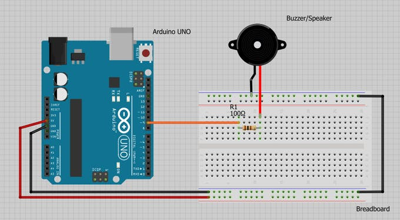

# RFID and Fingerprint Safe
This is a RFID and fingerprint safe that uses RFID technology and a fingerprint scanner to turn a servo that acts as the locking mechanism. When a RFID tag is sensed and the correct fingerprint is scanned the servo will rotate 90 degrees allowing the safe box to open.

| **Engineer** | **School** | **Area of Interest** | **Grade** |
|:--:|:--:|:--:|:--:|
| Sohan Shah | Xavier High School | Biomedical / Civil Engineering | Incoming Junior

<HTML>
  

  
</HTML>

# Demo Night 

{:target="_blank" rel="noopener"}
  
  
Overall, my experience as a Bluestamp Engineering student was great. I learned a lot and was able to complete a project that suited my interests and add several modifications of my choosing which were really cool to work with and see working in my final project. Over the course of this project, hard work truly paid off and confirmed my belief that if you are truly passionate about something, you will work as hard as possible and let this passion drive you to work hard and be successful.

# Final Milestone

{:target="_blank" rel="noopener"}
<HTML>

   

</HTML>
During my final milestone I made the wooden safe box, I added 4 led lights, a sound sensor, and attached all of the components onto the door of the box. The circuit in my final milestone now involves having two paths to unlock the safe. There is the original way with the RFID, fingerprint scanner, and voice command and the second path, that I added during this milestone, involves a knock sensor. The user has to say out loud a 4 digit password then knock, which would open the safe. The led lights are involved in the circuit as one lights up after each layer of security is passed. The sound sensor, which is the new component in my project, works by coding the sensor to detect sound when it is over a certain threshold determined by the user. The circuit works by displaying on the screen whether the user wants to unlock the safe through mode one or two. The user says one or two out loud and the Arduino recognizes the number said to determine whether it will run the code for mode one or two. If mode two is chosen, the next led light would light up, because the first led is always on indicating the safe is locked. Now the user has to say a 4 digit passcode outloud. While this is occurring the LCD display is showing asterisks when each correct digit is said. Once all four digits have been correctly said, the Arduino processes this information and turns on the third led light. Lastly the user has to knock on the door. The sound of the knock is sent to the Arduino to make sure it is loud enough, and if it is, the servo turns opening the safe and the final led turns on.

<HTML>

   

</HTML>

The steps I took during my final milestone begins by first testing the neopixels with a simple code found on the Arduino IDE. The code worked and allowed me to change the color and pattern of the neopixels. I then began integrating the code of the neopixels into my main code, and when I uploaded the code to the Arduino, the servo began to glitch and the LCD display faded. After trying to solve this problem, I realized that it was unfixable because there simply was not enough power to fuel the various components on the Arduino. Instead of using neopixels, I decided to use simple led lights. I used four led lights, each different colors and coded them to light up when each level of security on the box was passed. While adding 4 led lights may seem to be simple and easy, it was actually quite hard. Soldering each led, resistor, and wire to the perf board was not easy as these components were all close together so it was not easy making solder tracks. After soldering, I connected all of the leds to the Arduino and had to use the analog pins because all of the digital pins were already being used.

  
[LED, Voice Control, LCD, Buzzer, Fingerprint Scanner, RFID & Servo Code](images/led.ino)

                                                                       
After having the circuit part of my project complete, I made the safe box aspect of the project. I used pine wood and cut it with a chop saw to the desired dimensions. I used a Kreg Jig to create pocket holes to connect the sides of the box together. After doing so, I cut a thinner piece of wood for the back side, but continued to use pine wood for the door of the safe. I cut notches in the door to screw the hinges onto, then began drilling holes for the various components involved in the circuit. I used a jigsaw for the larger holes that had to be made, such as for the LCD screen and fingerprint scanner, and was able to use drill bits for the button, buzzer, leds, and microphone. Before staining the wood, I sanded the wood to a smooth finish. I used a red mahogany stain for the outside of the safe box and kept the inside with its natural wood finish. To preserve the stain I put a coat of polyurethane on the outside of the box. 
  
    
  
   
<HTML>
    
     
    
   
   

  

</HTML>
 
    
    
    
     
    
    
    
    
    
    
    

As another modification, I set up a sound sensor to have a threshold high enough so that it does not detect outside noise, just the sound of a knock. I soldered pins onto the sensor and connected the wires from the sensor to the corresponding pins on the Arduino. I found code online to turn on an LED when a knock was detected, and this was successful. Instead of adding this sensor as another level of security for the safe, I decided to create two unlocking paths. The first mode is the original circuit with the RFID, fingerprint scanner, and voice command, but the second mode starts with voice control where you have to say a numerical passcode, then knock, which opens the safe. I first separately created code to make this circuit with the voice command password and knock sensor. Creating this code was not difficult but I ran into minor bugs along the way which I fixed by making small adjustments. The code worked by having several "if" statements that when fulfilled would set a variable true allowing the next “if" statement to occur. This allowed me to have the voice command for one number after another, until all four correct numbers were said. After I was able to get the code to work, I combined it with my main code. I created the code so that the first prompt on the LCD display is asking to choose what mode or path you want to take to unlock the safe. When combining the code, I ran into a couple issues that came down to the way I formatted the code and how I set up all the “if” and “while” statements. I also ran into problems with the knock sensor being bypassed on the code. I resolved this by fixing a minor error where I had double equal signs when I only needed one, and by setting the variable that turned on the knock sensor off after it was done. In mode 2, with the knock sensor, I was unable to have the code where when I said “Lock,” the safe would lock. Again, I had an extra equal sign, but I also did not have that word defined in the setup, causing my code to not recognize when I said the word “Lock". 

[Final Code](images/Final.ino)
<HTML>

   

</HTML>

With my project complete I put all the parts into the safe box. I inserted the parts into the corresponding holes I made in the door of the safe. I also zip tied some of the wires together for better organization and used electrical tape to ensure all the pins stayed in place. I finally screwed all the components onto the back of the door, using hot glue when needed.
<HTML>

   

</HTML>
 
 
 
 
 
 
 
 
 
 
 
 
 

___
___

# Third Milestone

{:target="_blank" rel="noopener"}
<HTML>

   

</HTML>
During my third milestone, I added a LCD screen, another RFID tag, and a voice recognition module. The LCD screen is a 16x2 screen that can display characters by being backlit. The voice recognition module does not recognize an exact person’s voice but it understands the pitch and generally how the user sounds. The circuit with these two modifications works by first sensing the RFID card or tag, and if the correct one is sensed, the code would move onto the next layer of security which is the fingerprint scanner. If the correct fingerprint is scanned, the voice recognition module would turn on and be listening to hear the word “open". If the word “open” is said, the servo will open the safe. This whole time prompts are appearing on the LCD screen telling the user what to do and when to use the various sensors. To lock the safe, the user can either press the reset button or say the word “lock” which would close the safe.
<HTML>

   

</HTML>
The steps I took during this milestone began with downloading an external library because I was using an i2c module that acted as an adapter for the LCD display. The LCD display has 16 ports that the i2c module is able to cut down to 4 ports which allows my Arduino to have more room for the various other components that are apart of my project. After attaching the correct pins to the corresponding ports on the Arduino, I found a simple code on the internet that displays characters on the LCD display. I used this code as a way to learn about the different commands involved with displaying words on an LCD display. I learned that the LCD display is like a coordinate grid where you have to set what is being written on each line as well as the column the words will start on. When initially uploading this simple code, I ran into an error and this ended up occurring because of the external library I downloaded. The issue was that the setup command that I had in my code differed from the one found in the library I downloaded. After adjusting my code, it worked perfectly displaying my name on the screen. Knowing the LCD display works and knowing the code involved with the module, I was able to integrate the LCD code into my main code. I did not have to add any "if" statements because they were already in place. This is because previously I had to code the various sensors to work in a series which involved multiple "if" statements to tell the sensors when to turn on. I coded the LCD display to display messages prompting the user to, for example, scan their finger or card, and even had the display let the user know if the safe was unlocked or locked.

[LCD, Buzzer, Fingerprint Scanner, RFID & Servo Code](images/lcd.ino)

<HTML>

   

</HTML>
I added a second RFID card that would have access to the safe. When the second card is read, it will also be able to be sensed as correct. I did this by using “||” which essentially means “or” in code, so if either the RFID card or tag is sensed, they will both be sensed as correct and allow the code to move onto the next step.
<HTML>
 

   
 
    

</HTML>
After adding the LCD display, I began to work on the voice recognition module. The module did not come with pins that I could use to connect wires to, so I had to use pins from another module I was not using. I soldered those pins onto the voice recognition module then attached the wires to the corresponding ports on the Arduino. I found conflicting information on what ports I should use on the Arduino. Most sources said to attach them to ports 0 and 1 which are used specifically for serial communication which is important for the voice recognition module. Using these ports did not work, so I decided to use the regular digital pins and defined them as so in my code which ended up working. After successfully connecting the module, I downloaded an external library that included code to both set up and turn on an led with the voice recognition module. Setting up the voice recognition module was not too difficult as there was a menu in the serial monitor telling me what commands to type in order to train the module to recognize what I was saying. At first this was not working due to the pins being in the wrong ports, but was easily fixed by changing and redefining the pins. The two commands I trained the module to recognize were the words “open” and “lock". I connected a green led to my Arduino and tested the voice recognition with it, which worked. I was able to turn on the led by saying “open” and turn it off by saying “lock.” The reason why I am using these words is because they made sense with opening and locking the safe box. 
<HTML>

   

</HTML>
I modified the voice recognition and led code to turn a servo, then combined this code with my main code to add the voice recognition as a third level of security. Combining the voice recognition code with the main code was more difficult compared to combining the codes of the other sensors. First, I ran into the issue that my code file had become so large it became almost too large for the Arduino to handle with its little RAM. To counter this, I decided to delete some of the unnecessary code that printed messages on the serial monitor. I combined the code together to how I thought it should be and it complied, but when the code reached the part with the fingerprint scanner, the serial monitor would read “communication error". I isolated this problem to be that there was an issue in the setup with the fingerprint scanner and voice recognition module. In order to respond to this issue, I moved the setup for the voice recognition module until after the fingerprint module turned off, and before the voice recognition module turned on. This was a successful fix and now the voice recognition module worked. 

In order to lock the safe, I already have a reset button in place, but wanted to also have another option to reset and lock the safe using the voice recognition module. I had to define a variable and add an "if" statement, taking similar steps to when I used the voice recognition to open the safe. Initially I thought I could have a function that just said “reset;” but that did not work. I looked up other ways to reset the code and found a command which ended up working. When I said “lock” the servo turned locking the safe.

[Voice Control, LCD, Buzzer, Fingerprint Scanner, RFID & Servo Code](images/voice.ino)
<HTML>

   
  
 
 
  

</HTML>

 
 
 
 
 
 
 
 
 
 
 
 
 

___
___

# Second Milestone

<HTML>

   

</HTML>

During my second milestone I tested the fingerprint scanner, added a buzzer to play a melody when the servo turned 90 degrees, and integrated the fingerprint scanner with the RFID sensor to create a circuit where when both the correct RFID tag and finger is sensed, the servo will turn 90 degrees in addition to playing a melody through the buzzer. During this milestone I added the fingerprint scanner and a piezo buzzer. The fingerprint scanner is an optical sensor that takes a picture of the finger placed on it and stores the data produced by that image, so when the correct finger is placed on the sensor, it would recognize the finger. The piezo buzzer is a small component that has many purposes such as playing sounds, but they can also detect vibration. The circuit that I created during this milestone works by first scanning an RFID tag, and if this tag is correct, the Arduino would process this data and move onto the second layer of security which is the fingerprint scanner. Once this scanner is on, a red light will start to blink prompting the user to scan their finger, and if the correct fingerprint is scanned, the servo will turn 90 degrees. Not only this, but a melody will also play signifying that the opening procedure was a success. The main issue that I ran into during this milestone was integrating the codes of the RFID and fingerprint sensor. At first I thought I could create an if statement with 2 conditions, but that did not work, so instead I had to make it where a variable becomes true when the first condition is met, then make another if statement stating that if the variable is true to then turn the servo 90 degrees.

<HTML>

   
 

The steps I took during this milestone start with calibrating the fingerprint sensor to record and store my fingerprint. Before doing so, I first attached the corresponding pins to the Arduino. I used a code found on the Arduino IDE called “enroll” that gave prompts on the serial monitor telling me when I should place my finger in order for it to be recorded. After having my fingerprint stored in the scanner, I found a code online that could be used to turn a servo when the correct fingerprint is sensed. I modified the code to include the correct pins so it only went through my code once. After learning about how the fingerprint sensor worked, I decided to combine the code of that sensor with the RFID’s code. I copied the code for the fingerprint scanner into a new file of code because it seemed a bit more complex than the code for the RFID. I added the elements of RFID code including libraries, the tag’s identification number, and the "if" statement that made a servo turn when the correct tag was sensed. I was confused on how to combine the codes, so I tried the first idea that I thought of, which is creating an "if" statement with simply two conditions instead of one, but this idea did not work. So I began manipulating my code to where you had to scan the RFID card and place your finger on the sensor simultaneously in order for the servo to turn. In order to make the fingerprint sensor and RFID not have to work simultaneously, I instead had to make it where a variable becomes true when the first condition is met, then make another if statement stating that if the variable is true to turn on the next sensor. 

  

</HTML>

[Fingerprint Scanner, RFID & Servo Code](images/FingerprintScanner,RFID&ServoCode.ino)

Once this circuit successfully ran, I decided to add a buzzer that would play a melody when the servo opened the safe. First I tested the buzzer by just playing the melody without any conditions telling it to turn on. After this worked, I created a variable in order to turn true when both the RFID and fingerprint sensor read correct readings. Then I created an "if" statement that said that if the variable that I made was true, to turn on the melody. The last part of this milestone was upgrading the reset button to a bigger and nicer looking button, and switching the plastic geared servo to one that had metal gears and was compatible with metal hardware which would ensure the safe was strong when locked.

[Buzzer, Fingerprint Scanner, RFID & Servo Code](images/sound.ino)

<HTML>

   

</HTML>

<HTML>

   

</HTML>

 
 
 
 
 
 
 
 
 
 
 
 
 

___
___

# First Milestone

{:target="_blank" rel="noopener"}

<HTML>

   

</HTML>

<HTML>

   

</HTML> 

During my first milestone I tested the servo motor with a simple sweep code found on the Arduino IDE, set up the RFID sensor to sense the RFID tag with its unique identification number, and lastly integrated these two parts together to create a circuit where when the correct RFID tag is sensed, the servo motor turns 90 degrees. The main parts that were involved in the milestone are an Arduino microcontroller, a servo motor, and a RFID sensor with a RFID tag. An Arduino is a microcontroller which means it is essentially the brains of the circuit as it is where code is uploaded to and the component that sends and receives data from the various inputs and outputs that are connected to the Arduino. Without the Arduino, all of the sensors and outputs would be unable to work and communicate with each other. The servo motor is similar to a regular motor, but it cannot make a full 360 degree turn, it can only swing back and forth, which is important for my project as the servo acts as the locking mechanism, therefore I really only want it to move 90 degrees. The RFID sensor uses radio frequency to sense and identify an RFID tag. Each RFID tag has a unique identification number that allows it to be sensed and read. This is important for my project because if the correct RFID tag is read, this information is sent to the Arduino and back out to the servo in order for it to turn 90 degrees. The circuit works by first sensing any RFID tag that comes into close contact with it, and either accepting or rejecting the card based on its unique identification number. Next this information is sent back to the Arduino which processes it and either prints on the serial monitor “Wrong Card” or prints “Correct Card” and if the correct card is sensed, the Arduino tells the servo to turn 90 degrees which is what will unlock the safe box in the final project. 

<HTML>

   

</HTML>

The steps I took during my first milestone began with connecting the servo to the Arduino. The servo had three wires attached to it, one for power, ground, and the third wire is where information travels that tells the servo how far it should move left or right. After attaching the wires to their corresponding pins on the Arduino, I found code on the Arduino IDE that swings the servo which I used to test the servo. This code uses a “for loop” to ensure that the servo moves a certain amount of degrees, then returns back to its original position. I ran into a minor issue with uploading the code to my Arduino, but it was simply a privacy issue. 

<HTML>

   

</HTML>
After testing the servo, I moved onto the other major component which is the RFID reader. Before I could test it, I first soldered the pins that came with the RFID sensor to it so I could attach jumper wires and connect those to the Arduino. Once the sensor was connected to the Arduino I decided to test it to eventually have the RFID sensor trigger the servo to move 90 degrees. I found code online that was similar to my goal of using the RFID to turn on a servo, but I had to first download an external library which I never have done before. After learning how to do so by downloading and moving files I eventually successfully downloaded the RFID library needed for the code to work. In order for the code to be compatible with my RFID tag, I had to have the RFID sensor read the tag to print the tag’s unique identification number on the serial monitor. I inputted the identification number into my code so that my card will be read as the correct card when sensed. After doing so, I also manipulated other parts of the code in order to ensure the servo turned correctly. Finally I tested the code, and it was a success where when the RFID tag was sensed by the reader, the servo turned 90 degrees. After testing this circuit I realized that I had no way to return the servo back to the locked position, so I added a reset button which would reset the code and bring everything back to where it was before the code had run where the servo was in the lock position.

[RFID & Servo Code](images/RFIDServo.ino)

<HTML>

   

</HTML>

<HTML>

   

</HTML>

<HTML>

   

</HTML>
 
 
 
 
 
 
 
 
 
 
 
 
 

___
___

# Materials

1.Arduino
 
2.RFID Scanner
 
3.RFID Tags (2)
 
4.Fingerprint Scanner
 
5.Piezo Buzzer
 
6.LCD Display
 
7.I2C LCD adapter
 
8.Voice Recognition Module
 
9.Led Lights (4)
 
10.Resistors (4)
  
11.Jumper Wires (Many)
 
12.Arduino Power Adapter
 
13.Sound Sensor
 
14.Button
 
15.Servo
 
16.Servo Housing Bracket
 
17.Pine Wood
 
18.Hinges (2)
 
19.Perf Boards (2)
 
20.Header Pins (3)

